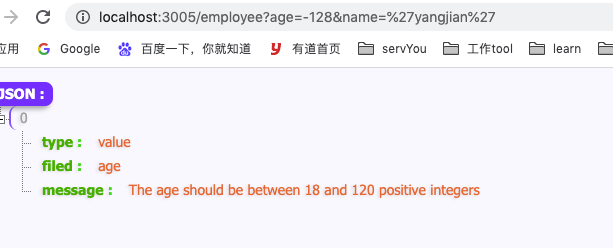

# galaxy validator
一个适用于node工程中小而好用的参数校验器。

## 特点
1. 返回一个promise,编程更加灵活
2. 使用oop(面向对象)class的方式编写业务层面的校验器，使用起来封装,继承和多态都更加友好
3. 常规校验的登记方式(比如 isInt, isEmail...)和使用antd中表单验证一样，对前端切换到Node的同学来说很友好
4. 自定义验证的方式应该说比体验比antd中的写法更加让人感到舒服，因为采用面向对象的方式去验证，在类里面只需要按照规则登记自定义函数即可
5. 异步验证也非常方便，和第四条使用基本一样，在服务端往往很多异步验证，比如验证当前用户是否存在，那可能需要先去查库。同样在class中按照规则登记需要异步验证的操作即可。
6. 解决了node js语言中的一个痛点，可灵活'正确的'获取前端传递过来的数据(详细见下 hook 部分)
7. 按需可自由的向数据池中挂载数据 (详细见下 数据池挂载业务数据 部分)
8. 对校验规则本身也会进行校验。
9. 验证不通过会详细的返回验证失败的原因，包括是那个字段/自定义验证函数，以及对于的message信息
10. 验证方式基于validator小巧，强大，用于扩展

## 使用
在galaxy-validator的包中会对外暴露两个对象，分别是Rule和 GalaxyValidator.
一般在开发者的校验层会先继承GalaxyValidator，然后再在自己的类中定义验证的方式

### GalaxyValidator
大多数是这么使用, UidValidator是业务层的校验器继承GalaxyValidator，然后在
UidValidator 中定义需要校验的参数和方式
一般是在构造函数中使用Rule去定义常规的验证(见下)
在class中使用validate+(大写字母)的方式来自定义验证函数。

```
// 用户校验器 validator/uid.js
class UidValidator extends GalaxyValidator{
   
}

```

```
// 用户的路由层(api层)
const { UidValidator } = require('./validator/uid');

// host/user?uid=121
router.get('/user', async(ctx, next)=>{
    try {
        const galaxy = await new UidValidator().validate(ctx);
        console.log(galaxy.get('query.uid'));
        console.log(ctx.galaxy.get('pool.pageInfo'));
    } catch (error) {
        console.log(error)
    }
    ctx.body = ctx.galaxy.get('query.uid');
    // or
    // const validator = new UidValidator();
    // validator.validate(ctx).then(galaxy=>{
    //     console.log(galaxy.get('query.uid'));
    //     console.log(galaxy.get('pool.pageInfo'));
    //     console.log(ctx.galaxy.get('pool.pageInfo'));
    //     ctx.body = 'ok11'
    // }, err=>{
    //     console.log(err)
    // });
});

```

#### 自定义验证函数
其函数名称是采用了驼峰命名规则，前缀是validate，galaxy会识别这种类型的函数，并去校验。自定义验证函数可以是异步验证。比如去数据库验证当前uid是否存在.自定义验证函数驼峰命名，前缀是validate遇到这一类的函数galaxy会去验证。
开发者在自定义验证的时候如果不符合期望可以抛出一个error会被galaxy捕获，最终返回给业务层。

#### 数据池挂载业务数据
如果符合期望的话可以不返回任何值。
也可以返回一个包含key,val的对象，此时galaxy会将val存储在一个数据池中，后续在任何地方都可以通过ctx,galaxy.get('pool.key')的方式获取存储的val。
这种场景一般是异步验证数据，可以将得到的数据存储下来，方便后续直接拿来用，而不用再次发出异步请求，以节省性能。
比如验证uid是否存在，往往在校验层从数据库查询是否有该条记录，如果该uid记录存在，并且其他规则都通过校验，可以将这userInfo记录下来，在后续业务层方便直接拿来用，而不用再次从数据库查询。

### Rule
Rule是用来登记一些常规的验证条件，比如isInt,isString,isEmail...实例化之后以数组的方式注册即可。这种使用方式是参照了antd的方式，使用起来体验比较好
常规条件的验证api可以参考validator，比如在UidValidator中的构造函数中:
```
class UidValidator extends GalaxyValidator{
    constructor(){
        super();
        this.uid = new Rule([
            {required:true, message:'uid是必填字段'},
            {type:'isInt', message:'请输入数字'},
            {type:'isLength', message:'至少5个字符，最多10个字符'},
        ]);
    }
}
```
如上面的登记方式，在构造函数中登记了this.uid的规则，galaxy就会对uid验证，看是否符合下面Rule中的各种规则，需要注意的是，如果其中有一条不符合，就不会验证下面的规则(自定义验证函数会验证)，比如上面需要uid是必需的，为数字，而且长度在5-10之间，如果通过第一条就会接着验证是否为数字，如果不是数字，就不会验证当前的长度是否是5-10之间了
对于开发者而言，往往不需要特别关注uid的值是从哪儿来的，因为galaxy会自己去请求的(body、query、path、header)中去寻找，这也极大的方便了开发者的使用。只要关注我的参数需要符合什么条件即可，其余的都交给galaxy吧。

#### 校验规则本身
如一开始提到的galaxy的特点之一，galaxy会对校验规则本身进行一个校验。大多数校验器可能会忽略这一点，但在galaxy中会在对参数值校验之前先对校验规则本身进行校验，比如required传入的不是布尔值，或者被配置多次，都会在控制台比较友好的红色打出相关信息，但你的服务不会挂掉，会以error的形式告知开发者，例如require被设置了两次都是true，这种写法可能不好，但也很难说是错的。会告知开发者，但服务不会因此而挂掉。

比如如果像下面一样注册规则，galaxy就会提示开发者对应的错误信息
```
class UidValidator extends GalaxyValidator{
    constructor(){
        super();
        this.uid = new Rule([
            // 注意required应该是boolean但这里传入的是number
            {required:121, message:'uid是必填字段'},
            {type:'isInt', message:'请输入数字'},
            {type:'isLength', message:'至少5个字符，最多10个字符'},
        ]);
    }
}
```
那galaxy就会在控制台提示你

再比如你多次注册了requierd
```
class UidValidator extends GalaxyValidator{
    constructor(){
        super();
        this.uid = new Rule([
            {required:true, message:'uid是必填字段'},
            {required:true, message:'uid是必填字段'},
            {type:'isLength', message:'至少5个字符，最多10个字符'},
        ]);
    }
}
```
显然这不是开发者一开始的目的，大多数时候都是复制之后忘记修改了，那galaxy就会在控制台提示你


### 别名
可能在某些场景下传递过来的参数和我们用到的参数可能不太一样，比如传递过来的id其实对于的就是我们的uid，galaxy也提供了对于的别名来解决此类问题
```
router.get('/user/:id', async(ctx, next)=>{
    const galaxy = await new UidValidator().validate(ctx, {
        uid:'id'
    });
})
```
如上配置，galaxy就会在验证uid的时候使用配置的别名id去path中获取相应的值。而登记规则的时候正常使用uid登记即可。

### hook 
galaxy validator 会在验证成功的时候再ctx中挂载一个钩子，其名为galaxy。也会在验证通过的时候将这个钩子直接返回给用户。
通过这个钩子用户可以获取前端传递过来的参数，也可以获取自己在自定义函数中挂载在数据池中的值。
之前使用node最烦的一点就是Node js get中会将传递过来的数字自动转为字符串比如uid 明明是123，但服务端传拿到的是 '123'.但我们需要验证他是个int类型的，更加神奇的是在后续业务中取这个数来用的时候还需要自己parseInt一下，想想也挺可怕的，传的是123，验证是Int,但我用的时候还是的parseInt一下。
但现在这一切galaxy validator都会帮你处理好。你只需要告诉galaxy这个值的路径即可，比如
```
router.get('/user', async(ctx, next)=>{
    try {
        const galaxy = await new UidValidator().validate(ctx);
        // 验证通过会直接将galaxy返回给用户
        console.log(galaxy.get('query.uid'));
        // 也可以通过ctx中获取
        console.log(ctx.galaxy.get('pool.pageInfo'));
    } catch (error) {
        console.log(error)
    }
});
```

#### 'galaxy'替换
当然如果你不喜欢galaxy这个关键字作为你的钩子，或者不巧在你已有的项目中galaxy已近被占用，那可以换另外任何一个你喜欢的名称。如下配置即可

```
router.get('/info', async(ctx, next)=>{
    try {
        const galaxy = await new UidValidator().validate(ctx, '', yourKey);
        // 验证通过会直接将galaxy返回给用户
        console.log(galaxy.get('query.uid'));
        // 也可以通过ctx中获取
        console.log(ctx.galaxy.get('pool.pageInfo'));
    } catch (error) {
        console.log(error)
    }
})
```
那么 yourKey 就会取代 galaxy变为新的钩子的名称

## 继承验证
采用 oop (面向对象)的验证有个好处，就是继承，封装都很方便。
如果某个验证比较具体，那就直接在对应的class中直接注册校验函数即可
如果某个验证比较通用，完全可以抽离出来作为一个基类，然后被别的校验函数继承使用
这里举一个例子

```
// 验证年龄，在这里是必填字段，为[18,120]区间内的正整数
class AgeValidator extends GalaxyValidator{
    constructor() {
        super()
        this.age = new Rule([
            {
                required:true,
                message:'age is a required field',
            },{
                type:'isInt', 
                message:'The age should be between 18 and 120 positive integers',
                options:{
                    min: 18,
                    max:120
                }
            }
        ])
    }
}
```
上面的验证只是针对年龄，可能很多地方都会用到，可以作为一个基类提供给其他类继承，例如：
```

// 这里继承了 AgeValidator 的验证
// 表明 EmployeeValidator 需要年龄符合，并且在此基础之上额外验证了姓名字段
class EmployeeValidator extends AgeValidator{
    constructor(){
        super()
        this.name = new Rule([
            {
                required:true,
                message:'Name is a required field',
            },{
                type:'isLength', 
                message:'At least 2 characters and a maximum of 10 characters', 
                options:{min:2,max:10}
            },
        ]);
    }
}
module.exports = {
    EmployeeValidator
}
```
your api.js
```
// employee?age=20&name='yangjian'
router.get('/employee', async(ctx, next)=>{
    try {
        const galaxy = await new EmployeeValidator().validate(ctx);
        const age = galaxy.get('query.age');
        const name = galaxy.get('query.name');
        ctx.body =`
        age: ${age}
        name: ${name}
        `;
    } catch (error) {
        console.log(error)
        ctx.body =error;
    }
});
```

如果你的请求为 /employee?age=-128&name='yangjian'
那就会得到如下的错误列表信息


## 返回结果

### 成功
如果都校验成功，那galaxy validator 会返回galaxy的钩子给开发者，开发者可以通过这个钩子对象，去获取前端传递过来的参数
或者是自己在自定义验证函数中挂载的数据。同样也会将galaxy挂载在ctx下面，这就是说在业务层或其他任何地方都可以很方便的获取希望获取的值

### 失败
如果失败，galaxy会将失败详情以一个数组的形式返回给业务层，由业务层决定如何处理。

| params  |  type    |    value                            | explain    |
|---------|----------|-------------------------------------|------------|
| type    | string   |    value/function                   | 错误的信息是使用Rule校验出错，还是自定义函数验证出错 |
| filed   | string   |    the parameter/function name      | 验证失败的字段名/自定义函数名 |
| message | string   |    Error message description        | 错误详情 |


## demo online
https://codesandbox.io/s/galaxy-validator-7ml16?file=/src/index.js
